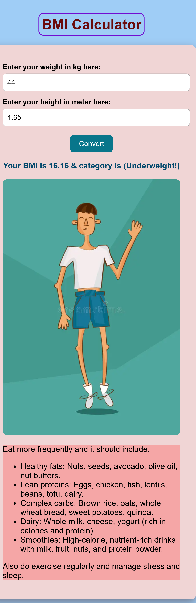

# 🧮 BMI Calculator
A simple Body Mass Index (BMI) Calculator built using JavaScript/HTML/CSS that takes user input (height and weight) and calculates their BMI, along with a category such as underweight, normal, overweight, or obese.

---

## 🚀 Features:

- Input fields for height(metre) and weight(kilogram)
- Real-time or button-triggered BMI calculation
- Displays BMI result with a picture and health category with some helpful suggestions
- Clean, responsive UI

---

## 🧠 What is BMI?

BMI (Body Mass Index) is a simple calculation using a person's height and weight:

\[
\text{BMI} = \frac{\text{weight (kg)}}{\text{height (m)}^2}
\]

---

## 📸 Screenshots
